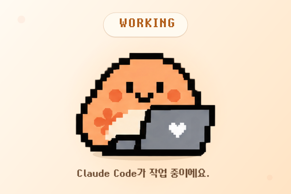
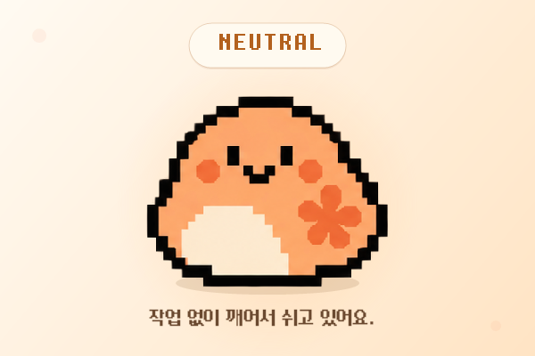

# 클로드가 끙차끙차 🧡

Claude Code가 지금 **일하고 있는지, 확인을 기다리는지, 일을 끝냈는지**를  
작은 데스크톱 캐릭터로 보여주는 Windows 앱입니다.

Claude Code가 열심히 작업 중이면 끙차끙차 움직이고,  
사용자 확인이 필요하면 알려주고,  
일이 끝나면 신나게 반응합니다.

한동안 할 일이 없으면 졸다가 잠들어요. 💤

**Windows 10/11 · 64-bit · Claude Code 전용**

## ✨ 어떤 앱인가요?

`클로드가 끙차끙차`는 Claude Code의 작업 상태를  
화면 위에 떠 있는 작은 캐릭터로 보여주는 데스크톱 펫입니다.

Claude Code를 사용하다 보면

“아직 작업 중인가?”  
“나한테 뭔가 물어보고 있나?”  
“벌써 끝났나?”

싶어서 Claude Code 창을 자꾸 확인하게 될 때가 있습니다.

`클로드가 끙차끙차`는 이런 상태를  
작은 캐릭터의 움직임으로 보여줍니다.

현재 다음 상태를 표현합니다.

- 작업 중
- 확인 요청
- 작업 완료
- 휴식
- 수면

여러 Claude Code 세션을 동시에 사용하는 경우에도  
각 세션의 상태를 종합해서 표시합니다.

## 🐣 상태 미리보기

| WORKING | REQUEST | DONE |
|:---:|:---:|:---:|
|  |  |  |

| NEUTRAL | SLEEPING |
|:---:|:---:|
|  |  |

## 📦 설치 방법

아래 설치 파일을 클릭해서 다운로드합니다.

[클로드가 끙차끙차_0.1.1_x64-setup.exe](./클로드가%20끙차끙차_0.1.1_x64-setup.exe)

다운로드한 설치 파일을 실행한 뒤 설치를 완료하면  
`클로드가 끙차끙차`를 사용할 수 있습니다.

별도의 개발 환경이나 직접 빌드는 필요하지 않습니다.

최초 실행 시 Claude Code 상태 연동을 위한 hook 설정이  
사용자 로컬 Claude Code 설정에 자동으로 추가됩니다.

- 기존 Claude Code 설정은 그대로 유지됩니다.
- 외부 서버로 설정을 전송하지 않습니다.
- 모든 구성은 사용자의 로컬 환경에서만 이루어집니다.

## 🖥 지원 환경

- Windows 10
- Windows 11
- 64-bit

현재 버전은 Windows용으로 배포됩니다.

## 🧡 주요 특징

- Claude Code 작업 상태 자동 표시
- 작은 크기의 항상 위 데스크톱 캐릭터
- 작업 중 / 확인 요청 / 완료 상태 표현
- 여러 Claude Code 세션 상태 종합
- 완료된 다른 작업이 있으면 말풍선으로 알림
- 유휴 상태가 지속되면 자연스럽게 수면 상태로 전환
- Windows 시스템 트레이 지원
- 시작 시 자동 실행 설정
- 마지막 창 위치 저장
- 별도의 온라인 계정이나 외부 서버 없이 로컬에서 동작

## 💬 말풍선 알림

Claude Code가 사용자 확인을 기다리고 있을 때:

`확인해주세요!`

다른 Claude Code 세션의 작업을 계속 수행하는 동안  
별도의 작업이 완료되면:

`끝난 업무가 있어요!`

라는 말풍선이 표시됩니다.

## 💤 쉬고 있을 때

Claude Code가 작업하고 있지 않을 때도  
끙차가 항상 같은 모습으로 멈춰 있지는 않습니다.

활성화된 이후 일정 시간 작업이 없으면

`NEUTRAL → DROWSY → SLEEPING → DEEP SLEEP`

순서로 점점 졸다가 잠들게 됩니다.

Claude Desktop 창이 열려 있지 않은 경우에는  
깊은 수면 상태로 들어갑니다.

## 🖱 사용 방법

캐릭터를 드래그해서  
화면 위 원하는 위치에 둘 수 있습니다.

앱을 관리하거나 완전히 종료하려면  
Windows 시스템 트레이의 `클로드가 끙차끙차` 아이콘을 사용하세요.

트레이 메뉴:

- 보이기
- 숨기기
- 시작 시 자동 실행
- 종료

## 🔍 Claude Desktop은 왜 사용하나요?

`클로드가 끙차끙차`의 핵심 상태 정보는  
**Claude Code의 작업 상태**를 기준으로 합니다.

일부 화면 표시 전환에는  
Claude Desktop 창이 현재 활성화되어 있는지도 함께 사용합니다.

즉 이 앱은 Claude Desktop 자체의 작업 상태를 표시하는 앱이 아니라,  
**Claude Code의 작업 상태를 캐릭터로 표현하는 앱**입니다.

## 🔐 개인정보 및 네트워크

`클로드가 끙차끙차`는  
캐릭터 상태 표시를 위해 로컬의 Claude Code 상태 정보를 사용합니다.

현재 앱 자체는 별도의 온라인 계정이나 외부 서버를 사용하지 않으며,  
캐릭터 상태 처리는 사용자의 로컬 환경에서 이루어집니다.

## ⚠️ Windows SmartScreen 안내

현재 설치 파일에는 정식 코드 서명이 적용되어 있지 않습니다.

따라서 Windows 환경에 따라  
SmartScreen에서 알 수 없는 게시자 또는 보호 경고가 표시될 수 있습니다.

## 🎨 폰트

앱의 말풍선에는 `물마루(Mulmaru)` 폰트를 사용합니다.

물마루 폰트는 SIL Open Font License 1.1에 따라 사용됩니다.

자세한 라이선스 정보는:

`THIRD_PARTY_LICENSES.txt`

를 참고해주세요.

## 🔎 파일 무결성 확인

배포 설치 파일의 SHA-256 값은

`SHA256SUMS.txt`

에서 확인할 수 있습니다.

## 📌 현재 버전

`v0.1.1`

신규 설치 환경에서 Claude Code 상태가 반영되지 않던 문제를 수정한 버전입니다.

## 🛠 개발 상태

현재는 **Claude Code 전용 버전**으로 개발하고 있습니다.

Claude Code와 함께 작업할 때  
조금 더 직관적이고 귀여운 데스크톱 경험을 만드는 것을 목표로  
조금씩 개선해나갈 예정입니다.

## 💡 이런 분께 추천해요

Claude Code에게 작업을 맡겨놓고

> “지금 작업 중인가?”  
> “내 확인을 기다리고 있나?”  
> “작업은 끝났나?”

하고 자꾸 창을 확인하게 되는 분에게 특히 잘 맞습니다.

화면 한쪽의 작은 끙차만 보면  
Claude Code의 현재 상태를 한눈에 확인할 수 있어요. 🧡
